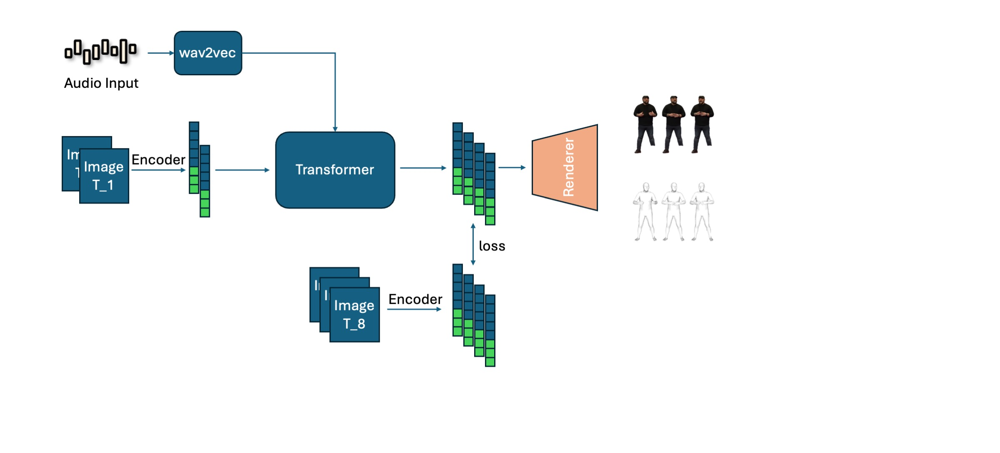

# 语音驱动数字人生成技术文档

## 背景介绍

传统的语音驱动人体动作生成通常采用分阶段的方法：首先从语音生成人体动作参数，然后将动作参数渲染为三维人体。这种方法存在两个主要问题：一是两个独立步骤的误差会相互叠加，影响最终效果；二是难以充分利用端到端的训练数据。

本项目采用端到端的训练方式，将语音驱动动作生成和三维人体渲染作为一个整体进行联合优化。这种方法的优势在于：
1. **端到端优化**：可以充分利用大量训练数据，实现语音到三维人体的直接映射
2. **避免误差累积**：消除了分阶段方法中误差叠加的问题，提升整体生成质量
3. **更好的音频-视觉对齐**：通过联合训练，能够更好地保持音频与视觉内容的同步性

## 二阶段Baseline

作为端到端方法的对比，我们实现了一个二阶段Baseline作为对比：

### 第一阶段：EMAGE音频驱动动作生成
- **方法**：使用EMAGE（Emotional Audio-driven Gesture Generation）方法
- **特点**：采用自回归（autoregressive）方式根据音频生成对应的全身动作
- **输入**：音频特征序列
- **输出**：SMPLX参数序列（包含身体姿态、手部动作、面部表情等）

### 第二阶段：LHM人体渲染
- **方法**：使用LHM方法
- **特点**：根据单张人体图像生成canonical人体Gaussian avatar
- **输入**：人体图像 + SMPLX参数序列
- **处理**：利用生成的SMPLX参数，采用线性混合蒙皮（LBS）对avatar进行驱动
- **输出**：渲染的动态视频

### Pipeline流程
```
音频输入 → EMAGE → SMPLX参数 → LHM → 渲染视频
```

## 技术框架

### 核心架构

本项目的技术框架主要分为两个核心部分：

#### 第一部分：基于SMPLX与Triplane的人体表示
基于smplx与triplane对人体进行表示，也就是将一个posed avatar隐式表示为smplx token与triplane token的组合，并可以转化为3D gaussian进行渲染。

#### 第二部分：音频驱动的运动生成
利用演讲视频数据，用音频特征对隐式人体特征进行驱动，同时生成人体动作与3D gaussian表达下的数字人。

### 模块结构图

#### 总体架构概览


#### Stage 1: 人体表示学习


#### Stage 2: 音频驱动生成


## 代码说明

### 代码结构与模块说明

```
audio_motion_avatar/
├── src/
│   ├── main.py                    # stage1网络训练脚本
|   ├── main2.py                   # stage2网络训练脚本
│   ├── models/
│   │   ├── lightning_model_wrapper.py    # Lightning模型包装器
│   │   ├── triplane_net.py              # 三平面网络
│   │   ├── triplane_audio_net.py        # 音频驱动三平面网络
│   │   └── renderer.py                  # 渲染器
│   ├── datasets/
│   │   ├── dataset_speech_vid.py        # 语音视频数据集
│   │   ├── dataset_idol.py              # IDOL数据集
│   │   ├── dataset_thuman.py            # THuman数据集
│   │   └── dataset_factory.py           # 数据集工厂
│   ├── configs/
│   │   ├── config_ted_driven.yaml       # TED驱动配置
│   │   └── config_loader.py             # 配置加载器
│   └── utils/
│       ├── loss_utils.py               # 损失函数
│       └── data_utils.py               # 数据处理工具
```

**核心模块**：
- `triplane_net.py`: 根据人体图片，得到SMPLX+triplane复合表示
- `triplane_audio_net.py`: 根据音频驱动复合表示的生成
- `renderer.py`: 根据复合表示decode出3D gaussian表达，并且进行渲染
- `dataset_speech_vid.py`: 音频-视频数据集处理
- `dataset_idol.py`: IDOL数据集处理
- `dataset_thuman.py`: THuman数据集处理


## 环境配置与数据准备

### 依赖安装

#### 快速安装
```bash
# 创建环境
conda create -n audio_avatar python=3.10
conda activate audio_avatar

# 安装PyTorch 2.7.1 (CUDA 11.8)
pip install torch==2.7.1+cu118 torchvision==0.22.1+cu118 torchaudio==2.7.1+cu118 --index-url https://download.pytorch.org/whl/cu118

# 安装其他依赖
pip install -r requirements.txt
```

#### 手动安装特殊依赖
```bash
# PyTorch3D安装源码编译
git clone https://github.com/facebookresearch/pytorch3d.git
cd pytorch3d
pip install -e .

# diff-gaussian-rasterization安装
git clone https://github.com/graphdeco-inria/diff-gaussian-rasterization.git
cd diff-gaussian-rasterization
pip install -e .
```

### 二阶段环境配置
#### 在baseline目录中配置PantoMatrix和LHM

```bash
# 进入baseline目录
cd baseline

# Clone PantoMatrix
git clone https://github.com/PantoMatrix/PantoMatrix.git
cd PantoMatrix
cd ..

# Clone LHM
git clone https://github.com/aigc3d/LHM.git
cd LHM
# 根据CUDA版本选择安装脚本
sh ./install_cu118.sh  # CUDA 11.8
# 或
sh ./install_cu121.sh  # CUDA 12.1
cd ..
```

#### baseline目录结构

```
baseline/
├── PantoMatrix/                    # EMAGE音频驱动动作生成 (符号链接)
│   ├── test_emage_audio.py         # EMAGE推理脚本
│   ├── examples/                   # 示例音频和输出目录
│   └── ...
├── LHM/                           # Live Human Mesh人体渲染
│   ├── inference.sh               # LHM推理脚本
│   ├── configs/                   # 配置文件
│   ├── engine/                    # 引擎组件
│   ├── LHM/                       # 核心模型代码
│   └── ...
├── audio_motion_retargeting/      # 动作序列格式转换
│   └── process_motion_seq.py      # SMPLX参数处理脚本
```

#### PantoMatrix (EMAGE音频驱动动作生成)
- **项目地址**: [https://github.com/PantoMatrix/PantoMatrix](https://github.com/PantoMatrix/PantoMatrix)
- **简介**: 开源的语音驱动人体动作生成项目，支持从音频生成SMPLX参数
- **主要模型**: EMAGE (CVPR 2024) - 全身+面部动画生成


#### LHM ( Large Animatable Human Reconstruction Model from a Single Image in Seconds人体渲染)
- **项目地址**: [https://github.com/aigc3d/LHM](https://github.com/aigc3d/LHM)

### 模型准备

**预训练模型下载**:
- [SMPLX模型](https://smpl-x.is.tue.mpg.de/) - 下载SMPLX_MALE.npz, SMPLX_FEMALE.npz, SMPLX_NEUTRAL.npz
- [Wav2Vec2模型](https://huggingface.co/facebook/wav2vec2-base-960h) - 自动下载
- [Sapiens模型](https://github.com/facebookresearch/sapiens) - 下载sapiens_1b_epoch_173_torchscript.pt2

**训练checkpoint**

压缩文件中的checkpoint为在ted演讲视频clip数据上训练的完整checkpoint：audio_motion_avatar_full.ckpt，后续的inference中直接load该checkpoint即可得到。

**模型文件路径配置**:
```yaml
# SMPLX模型路径 (在 src/configs/model/triplane_net.yaml 中)
model:
  triplane_net:
    smplx_model_path: "/path/to/smplx"

# Sapiens模型路径 (在 src/configs/model/sapiens_encoder.yaml 中)
model:
  sapiens_encoder:
    sapiens_model_name: "/path/to/sapiens_1b_epoch_173_torchscript.pt2"

# Wav2Vec2模型路径 (在 src/configs/datasets/ted_speech.yaml 中)
dataset:
  wav2vec2_model_path: "/path/to/wav2vec2-base-960h"
```

### 数据准备

#### THuman2.1数据集
- **数据来源**: THuman2.1数据集包含高质量的人体扫描数据
- **渲染流程**: 利用人体扫描，通过多视角渲染生成训练图像。渲染
- **用途**: 用于训练人体表示学习模块

#### TED演讲视频数据集
- **数据来源**: 从TED演讲视频中捕捉音频-视频-动作
- **处理流程**: 
  - 提取视频中的人体图像序列
  - 使用Wav2Vec2提取音频特征
  - 生成对应的SMPLX参数和相机参数
- **数据特点**: 包含真实的演讲场景，音频与视频同步
- **用途**: 用于训练音频驱动的运动生成模块
2
## 训练、推理与测试

### 训练流程

#### Stage 1: 人体表示学习训练
在THuman数据集上训练重建网络，学习人体图像到SMPLX+Triplane复合表示的映射。

**训练命令**:
```bash
# 在thuman2.1数据集进行训练
python -m src.main --config src/configs/config_stage1.yaml --mode train

# 在ted演讲视频进行训练
python -m src.main --config src/configs/config_thuman.yaml --mode train
```

**参数修改方法**:
```yaml
# 修改 src/configs/config_thuman.yaml
training:
  max_epochs: 30          # 增加训练轮数
  batch_size: 4           # 根据GPU显存调整
  learning_rate: 5e-5     # 调整学习率

model:
  triplane_net:
    triplane_resolution: 64    # 提高三平面分辨率
    triplane_feature_dim: 512  # 增加特征维度
```

#### Stage 2: 语音驱动网络
在TED演讲视频数据集上训练音频驱动的运动生成网络，学习从音频特征到人体动作的映射。

**训练命令**:
```bash
# 在TED演讲视频数据集上进行音频驱动训练
python -m src.main2 --config src/configs/config_stage_2.yaml --mode train
```

### 推理测试

**测试命令**:
```bash
# 使用训练好的模型进行推理测试
python -m src.main2 --config src/configs/config_stage_2.yaml --mode demo \
    --checkpoint audio_motion_avatar_full.ckpt
```

**说明**: 使用`--mode demo`进行推理演示，加载指定的checkpoint文件进行音频驱动视频生成。

<!-- ### 模型评估 -->


### 二阶段Baseline推理

#### 手动执行三个步骤

**环境变量设置**:
```bash
# 必须设置的环境变量

export NCCL_IB_DISABLE=1
export NCCL_P2P_DISABLE=1
```

**步骤1: EMAGE音频驱动动作生成**

通过修改命令行参数指定音频路径和动作输出路径
```bash
cd baseline/PantoMatrix
python test_emage_audio.py --visualization --audio_folder ./examples/audio --save_folder ../examples_motion/
```

**步骤2: 动作序列格式转换**
```bash
cd baseline/audio_motion_retargeting
# 修改process_motion_seq.py中的输入输出路径
python process_motion_seq.py --moiton_folder ../examples_motion/
```

**步骤3: LHM人体渲染**

设定/path/to/images为retarget的目标的图片，/path/to/motion/smplx_params为步骤2中输出动作的路径。
```bash
cd baseline/LHM
bash ./inference.sh LHM-500M /path/to/images/ /path/to/motion/smplx_params
```


